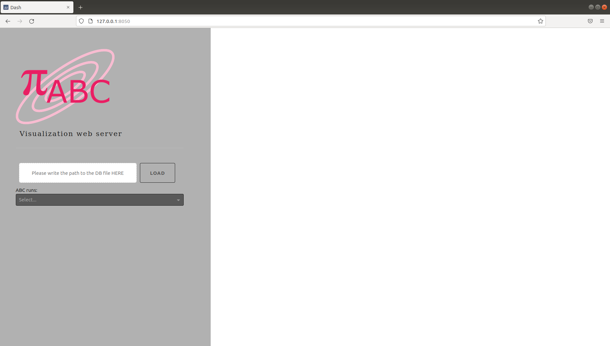

.. _web_visualization:

Visualization and analysis
==========================

Plotting
--------

pyABC offers a variety of routines to visualize and analyze results.
Usage examples are given in the :ref:`Examples section<examples>`.
An overview of all plotting routines can be found in the
:ref:`Visualization API documentation <api_visualization>`.
Further, functions to correctly extract statistics, in particular
on importance samples obtained via ABCSMC, can be found in the
:ref:`Weighted statistics API documentation <api_weighted_statistics>`.

Visualization server
--------------------

pyABC comes with a visualization server based on the data visualization
tool Dash,
to interactively display information on running and completed jobs.

You can launch it from the command line with

.. code-block:: bash

    abc-server-dash

By default, this opens a web server on port 8050.

You should see something similar to the following:

You can upload your database to the server by providing the absolute or relative path to your database file. Please ensure that your database file has a ``.db`` extension.

The duration of the upload process will depend on the size of your database. Upon completion, you will receive a notification message indicating the success or failure of the upload process:

If not, then you will receive an error message describing the issue

If the metadata of your file appears, that means your database file was uploaded successfully.

.. image:: server_screenshots/dash_meta.png

After a successful upload, you can select the ID of the specific run you wish to analyze (the first run will be automatically selected by default). Upon selecting the run's ID, the right panel of the page will update to show detailed information about the selected run:

The upper section of the loaded page will contain some general information about the selected run:

On the lower section, the user can select one of the plots by selecting one of the tabs under ``Run's plots``

Upon selection, the corresponding plot will be displayed. These plots can be adjusted using tools found in the ``Plot configuration`` box. For certain tabs, you may be required to select one or more parameters from a dropdown list.

To save a plot, simply right-click on the plot and choose ``Save image as``.

If you wish to access the code used to generate a specific plot, click on ``Copy code to clipboard`` placed below the figure.

For further assistance or to explore more available options (like selecting a different port), type the following command into your command line:

.. code-block:: bash

   abc-server-dash --help

Visualization server -- using Flask
-----------------------------------

Note: This web-server is deprecated and no longer maintained.

Further, pyABC comes with a web server based on the micro web framework Flask.
You can launch it from the command line with

.. code-block:: bash

    abc-server-flask <databasename>

It opens per default a web server on port 5000.

You should see something similar to the following:

.. image:: server_screenshots/main.png

Via "Go to ABC Run List", you can see all running and finished ABC runs, which you can then inspect in more detail.

You can get overviews over the models:

.. image:: server_screenshots/model_overview.png

Information about individual model parameters for each model and time point is also displayed:

.. image:: server_screenshots/model_detail.png

Type in the command line

.. code-block:: bash

   abc-server-flask --help

To get more information on available options, such as selecting another port:

.. code-block:: bash

   abc-server-flask --port=8888 <databasename>
