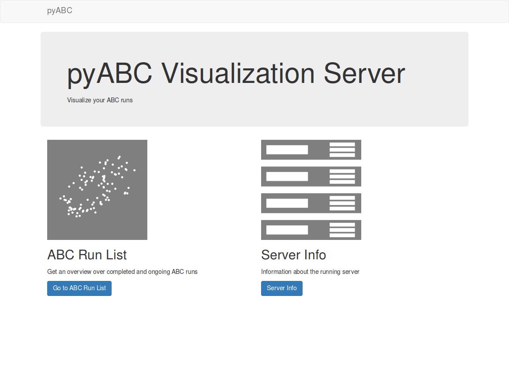

Web based visualization
=======================

This tool comes with a webserver, which displays lots of useful information on the currently running
and already completed ABC tasks. You can launch it with

.. code::

    abc-server <databasename>

It open as default a web server on port 5000.

You should see something similar to the following

