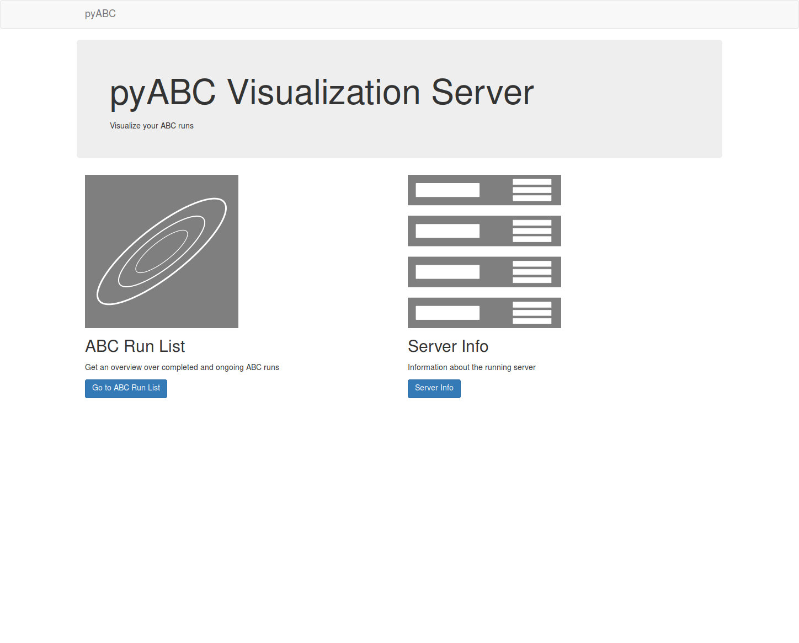
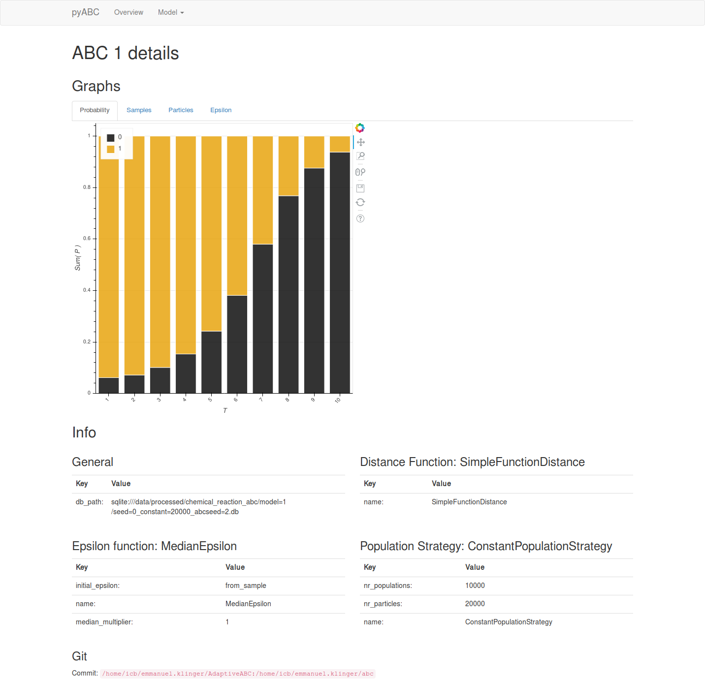
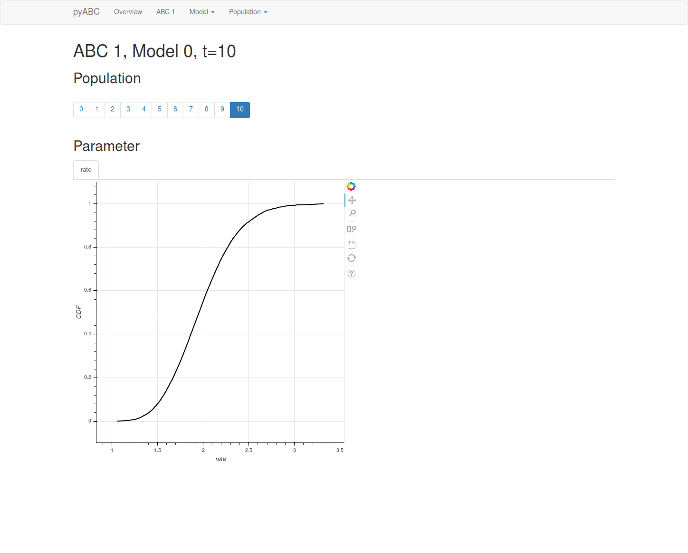

Web based visualizations
========================

The pyABC package comes with a webserver, which displays lots of useful
information on the currently running and already completed ABC tasks.
You can launch it from the command line with

.. code-block:: bash

    abc-server <databasename>

It open as default a web server on port 5000.

You should see something similar to the following

You can get an overview over the models:

Information about individual model parameters is also displayed.

Type in the command line

.. code-block:: bash

   abc-server --help

To get more information on available options, such as selecting another port:

.. code-block:: bash

   abc-server --port=8888 <databasename>