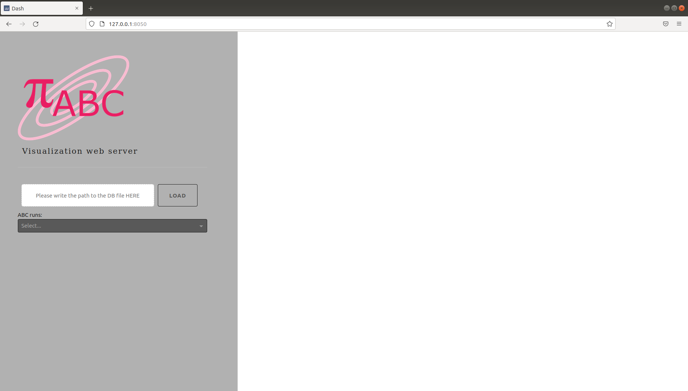
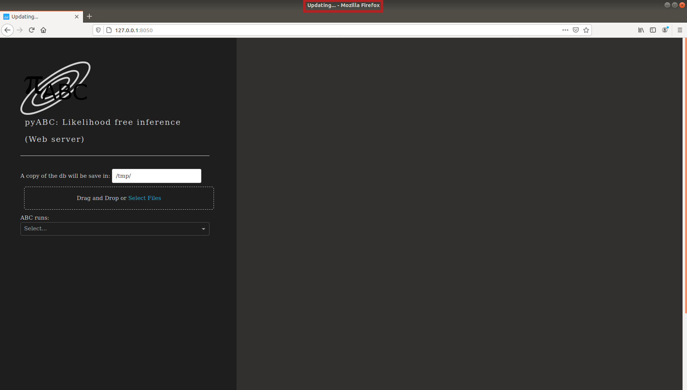
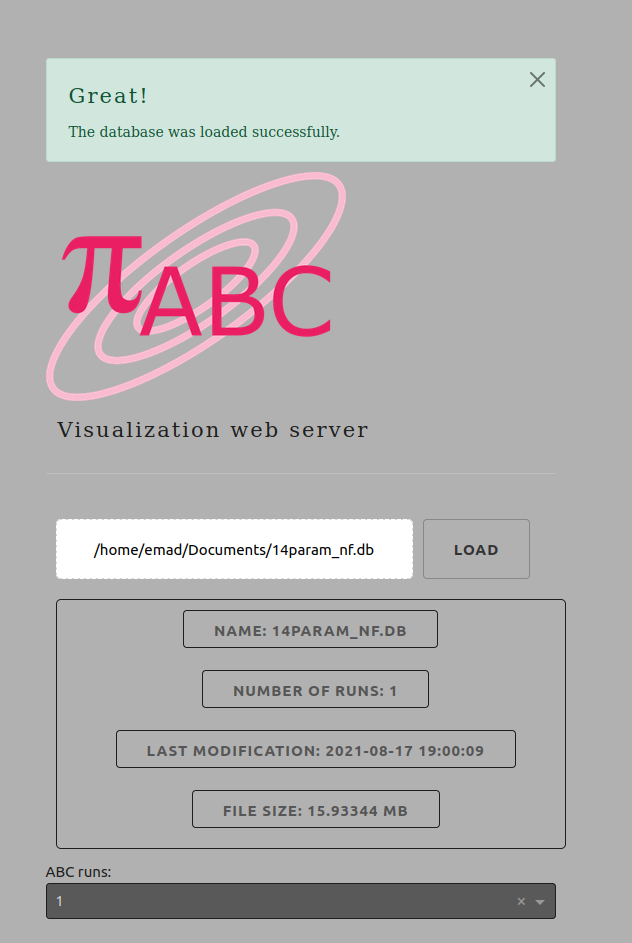

.. _web_visualization:

Web based visualizations
========================

The pyABC package comes with a web server, which displays lots of useful
information on the currently running and already completed ABC tasks.
You can launch it from the command line with

.. code-block:: bash

    abc-server-dash

It opens per default a web server on port 8050.

You should see something similar to the following:

A copy of the selected database will be saved on `/tmp/`

if you want to change the path, you can enter the full path of the new folder in the text box.

to upload you database, you can click or drag and drop you file dashed rectangle. Please note that the database file should have the extintion `.db`

The time taken to upload the database to the server will depend on the database size. once you select your database, you will notice that the title bar of you tab changed to `uploading`.

If the metadata of your file appreas, that means your database file was uploded succssesfully.

you can then select the requested run's ID. 

Once you slelct the run's ID, the left side of he page will be updated to show more details about the selected run. 

then, you can select one of the tabs under `Run's plots`.

To save any plot, right-click on the plot and then slelct `save image as`.   

You can get overviews over the models:

Information about individual model parameters for each model and time point is also displayed:

Type in the command line

.. code-block:: bash

   abc-server-dash --help

To get more information on available options, such as selecting another port:

.. code-block:: bash

   abc-server-dash --port=8888
